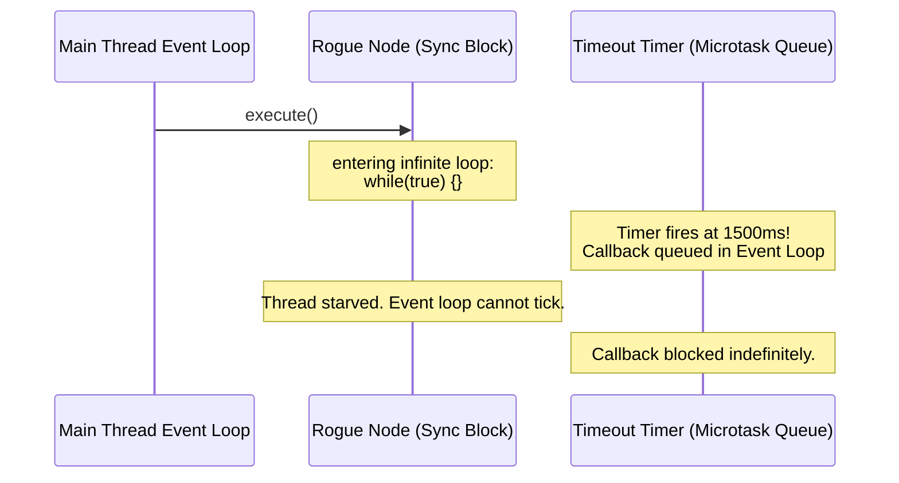
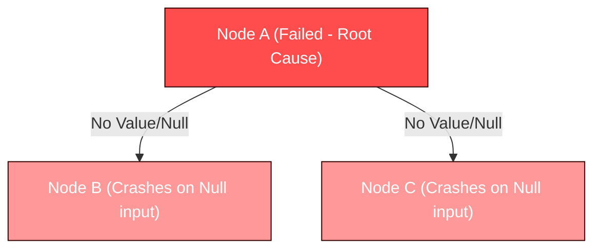

# Formal Interrogation & Architectural Analysis: `litegraph-fp` Execution Engine

**Authored by:** Distinguished Systems Architect & Research Scientist  
**Scope:** Evaluation of the Purely Functional Dataflow Engine (`src/engine/`)  
**Context:** Verification of Mars-Grade Fault Tolerance and First-Principles Alignment  

---

## Executive Summary

The `litegraph-fp` engine achieves a clean separation of concerns by treating the graph as an inert data structure (First Principle #2) and evaluating it via a pure-functional topological reducer (First Principle #1). However, from a rigorous systems-research perspective, several design assumptions exhibit theoretical vulnerabilities when exposed to real-world edge cases. 

This document interrogates the engine across four core vectors:
1. **Thread Starvation & Watchdog Bypass** (CPU-bound concurrency limits)
2. **State Accumulation & Memory Leakage** (long-running execution degradation)
3. **Upstream Cascading Error Flooding** (lack of failure isolation)
4. **Static Type Rigidity vs. Machine Learning Dynamic Dimensions** (tensor shape matching)

Below is a detailed analysis of these vulnerabilities along with formal, systems-level remediation strategies.

---

## 1. Thread Starvation & Watchdog Bypass

### The Interrogation
The engine boasts a "Mars-Grade Watchdog" utilizing `Promise.race` and `AbortController` to terminate long-running or hung nodes:

```typescript
const executionPromise = (async () => nodeDef.execute(resolvedInputs, params, signal))();
const timeoutPromise = new Promise((_, reject) => {
    timerId = setTimeout(() => {
        controller.abort();
        reject(new Error("Timeout"));
    }, timeoutMs);
});
await Promise.race([executionPromise, timeoutPromise]);
```

Because JavaScript is single-threaded and relies on **cooperative multitasking**, this watchdog is a theoretical illusion for CPU-bound synchronous code. If a node contains an infinite synchronous loop (e.g., `while(true) {}`) or a heavy, blocking computation:
- The event loop is completely starved.
- The `setTimeout` callback in `timeoutPromise` is queued but *never* executes.
- The thread hangs permanently, freezing the browser or process, rendering the watchdog powerless.



### The Scientific Recommendation (Web Worker Thread Pools)
To achieve true, preemptive watchdog protection, compute-heavy nodes must be offloaded to **Web Workers**. The main thread remains responsive, coordinates the timer, and calls `worker.terminate()` if a timeout is reached.

```typescript
// Proposed Worker pool execution architecture
const executeInWorker = (nodeId: NodeID, code: string, inputs: any): Promise<any> => {
    return new Promise((resolve, reject) => {
        const worker = new Worker(new URL('./node_worker.js', import.meta.url));
        const timer = setTimeout(() => {
            worker.terminate(); // Preemptive assassination
            reject(new Error(`Timeout: Node ${nodeId} terminated by host watchdog.`));
        }, timeoutMs);
        
        worker.onmessage = (e) => {
            clearTimeout(timer);
            resolve(e.data);
        };
        worker.postMessage({ code, inputs });
    });
};
```

---

## 2. State Accumulation & Memory Leakage

### The Interrogation
In a functional reducer, the graph state is passed continuously from execution tick to execution tick. The engine implements a transient mutation optimization:

```typescript
const activeState: Record<string, unknown> = { ...initialInputs };
```

Every time a node is evaluated, its output values are written to `activeState` with keys formatted as `${nodeId}.${outputPin}`. 
However, **there is no garbage collection pass on this state**. 

If a user repeatedly edits the graph:
1. Deleting a node does not remove its previous outputs from the active state dictionary.
2. Renaming a pin leaves the old pin's output floating in memory.
3. Over time, `activeState` accumulates stale keys indefinitely, increasing memory footprints and causing garbage collection thrashing during cloning.

### The Scientific Recommendation (Active State Garbage Collection)
Introduce a **State Reclamation Phase** at the end of the evaluation cycle. Collect the set of all active output pins currently declared by the graph's nodes. Evict any key in `activeState` that does not correspond to an active, registered node pin.

```typescript
export const collectGarbage = (state: ExecutionState, graph: GraphState, registry: NodeRegistry): ExecutionState => {
    const cleanedState: Record<string, unknown> = {};
    
    // Build set of valid keys
    const validKeys = new Set<string>();
    Object.entries(graph.nodes).forEach(([nodeId, node]) => {
        const def = registry[node.type];
        if (def) {
            // Retain provides
            Object.keys(def.provides).forEach(pin => validKeys.add(`${nodeId}.${pin}`));
            // Retain requires (for default/manual parameter entries)
            Object.keys(def.requires).forEach(pin => validKeys.add(`${nodeId}.${pin}`));
        }
    });

    // Reclaim memory
    Object.entries(state).forEach(([key, value]) => {
        if (validKeys.has(key)) {
            cleanedState[key] = value;
        }
    });

    return cleanedState;
};
```

---

## 3. Upstream Cascading Error Flooding

### The Interrogation
First Principle #7 dictates "Failure is Data, Not Catastrophe". When a node fails, the exception is caught, and the error is written to the `errors` dictionary:

```typescript
const executeSafely = async (nodeId: NodeID) => {
    try {
        await evaluateNode(nodeId);
    } catch (error: any) {
        runtimeErrors[nodeId] = error?.message || "Unknown error";
    }
};
```

This is excellent for sibling independence. However, if a root node (e.g., `Node A` in Tier 1) fails, it produces no output values (or outputs default to `null`). 
All downstream nodes in Tier 2 and Tier 3 that depend on `Node A`'s output will proceed to execute anyway. They will receive `null` or `undefined` inputs, fail type validation or crash runtime checks, and throw their own exceptions.

* **Consequence**: A single node failure in Tier 1 floods the `errors` dictionary with dozens of cascading errors from downstream nodes, masking the true root cause and overwhelming the user interface.



### The Scientific Recommendation (Error Short-Circuit / Skip State)
Implement an **Upstream Failure Skip Strategy**. Before evaluating a node, check if any of its incoming edges originate from a node that has already failed (recorded in `runtimeErrors`). If so, short-circuit execution, bypass calling the node logic, and record its status as `Skipped: Upstream dependency failed`. This cleanly isolates the root error.

```typescript
// Proposed short-circuit logic inside evaluateNode
const resolveIncomingDependencies = (nodeId: NodeID): boolean => {
    const incomingEdges = edgeIndex.get(nodeId) ?? [];
    for (const edge of incomingEdges) {
        if (edge.sourceNodeId in runtimeErrors) {
            runtimeErrors[nodeId] = `Skipped: Upstream dependency '${edge.sourceNodeId}' failed.`;
            return false;
        }
    }
    return true;
};
```

---

## 4. Static Type Rigidity vs. Dynamic Tensors

### The Interrogation
The graph validator checks tensor compatibility using exact shape matching:

```typescript
if (source.shape.length !== target.shape.length) return false;
for (let i = 0; i < source.shape.length; i++) {
    if (source.shape[i] !== target.shape[i]) return false;
}
```

In data science, machine learning, and computer vision pipelines (which are primary use cases for functional dataflow graphs), tensor dimensions are frequently dynamic. For example:
- A batch size dimension is often variable and represented by `-1` or `null`.
- Image dimensions might be dynamic until loaded at runtime.

Requiring exact shape equality statically halts execution for perfectly valid dynamic pipelines (e.g., connecting a dynamic batch tensor `[-1, 256]` to a node expecting a concrete batch size like `[32, 256]` or another dynamic shape).

### The Scientific Recommendation (Wildcard Dynamic Matching)
Refactor `isCompatible` to recognize wildcards (e.g., `-1`, `null`, or `undefined`) in tensor shapes, treating them as compatible with any concrete integer dimension.

```typescript
// Harden isCompatible for dynamic dimensions
if (source.type === 'tensor' && target.type === 'tensor') {
    if (source.dtype !== target.dtype) return false;
    if (source.shape.length !== target.shape.length) return false;
    for (let i = 0; i < source.shape.length; i++) {
        const sDim = source.shape[i];
        const tDim = target.shape[i];
        
        // Treat -1, null, or undefined as dynamic wildcards
        const isDynamicSource = sDim === -1 || sDim === null || sDim === undefined;
        const isDynamicTarget = tDim === -1 || tDim === null || tDim === undefined;
        
        if (!isDynamicSource && !isDynamicTarget && sDim !== tDim) {
            return false;
        }
    }
    return true;
}
```

---

## Summary of Next Action Steps

| Vulnerability | Remediation | Complexity | Impact |
|---|---|---|---|
| **CPU Starvation** | Offload compute nodes to Web Worker pool | High | Prevents complete UI lockups |
| **State Bloat** | Garbage collect stale keys in `activeState` | Low | Solidifies long-running session safety |
| **Cascading Failures** | Skip node evaluation if dependency is in `errors` | Medium | Isolates root-cause visual feedback |
| **Rigid Tensor Shapes** | Implement dimension wildcard matching (`-1`/`null`) | Low | Enables machine learning workflows |
